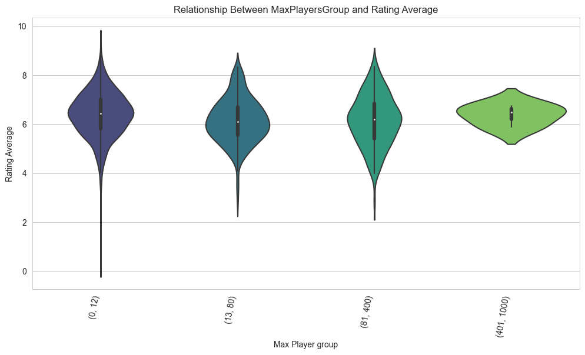
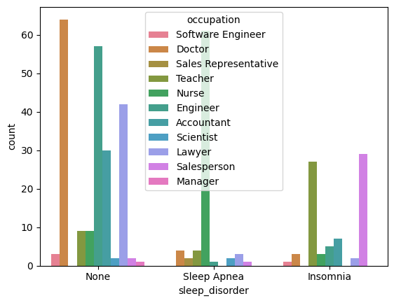
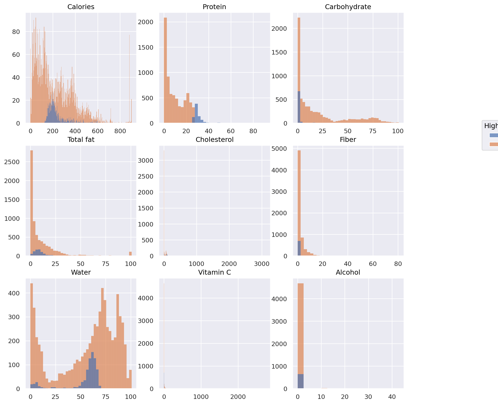

# My Data Playground

Repo to keep and play with little ideas, POCs or new libraries and tools.

## Projects

### [Toyota's Official Second-hand Car Offers](toyota-ocasion/)

Dashboard and ETL with toyota's car offers deployed [here](https://toyota-ocasion-spain.streamlit.app/).

## Data Competitions

### DataCamps

I have been enrolled in DataCamp for quite some time, over a year, I completed the full track 'Machine Learning Scientist'
and other AI and data courses. But also participated in some of their internal Data Competitions, I share those here.

### [Board Game](data-competitions/datacamp-board-game/notebook.ipynb)

This notebook explores and analyzes the BoardGameGeek dataset to uncover insights about ranked board games. It covers data cleaning, feature extraction, and investigates relationships between game attributes such as number of players, ratings, and rank, using pandas, numpy, seaborn, matplotlib, and missingno. Main sections include EDA, null data analysis, feature engineering, and correlation studies.

### [Good Sleep](data-competitions/datacamp-good-sleep/notebook.ipynb)

This notebook analyzes the relationship between lifestyle, health, demographic factors, and sleep quality using an anonymized dataset. The aim is to identify factors that correlate with poor sleep health and provide recommendations for improvement.

**Libraries Used:**
- pandas, numpy
- seaborn, matplotlib
- scikit-learn (preprocessing, modeling, metrics)

**Main Sections:**
1. Challenge Overview & Data Description
2. Data Import and Initial Exploration
3. Data Cleaning (renaming columns, splitting blood pressure, handling missing values, reordering columns)
4. Exploratory Data Analysis (EDA): uniques, distributions, visualizations
5. Preprocessing: feature engineering, encoding, handling categorical variables
6. Recommendations for Improving Sleep Health: correlation analysis, visual insights
7. Modeling (classification setup, feature importance)
8. TODOs and Next Steps

### [Nutrition Fact Check](data-competitions/datacamp-nutrition-fact-check/notebook.ipynb)

This notebook analyzes nutrition data to answer key questions about food composition, vitamin C sources, and the impact of different diets using data science techniques.

**Libraries Used:**
- pandas
- matplotlib
- seaborn
- scikit-learn

**Main Sections:**
1. Data loading and cleaning
2. Exploratory analysis of fruits and vitamin C sources
3. Relationship between calories and water content
4. Analysis of zero-carb and high-protein diets
5. Linear model fitting for calorie estimation
6. Error analysis and hidden calorie sources
7. Visualizations and summary comments

## Learning Material

This repo also include some of my self-crafted learning material, like:

- MLFlow Slides and ANKI Cards: [link](mlflow-playground/learning/)
- Databricks SQL Guide and ANKI Cards: [link](databricks-playground/learning/)

...
